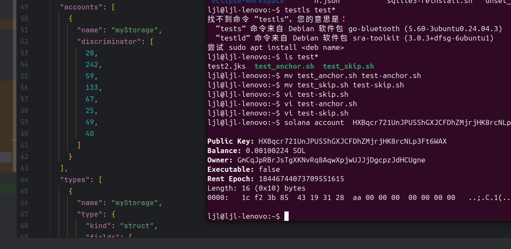

# my storage 



# types  discrimator
- target/types/day16.ts
```json 
 "accounts": [
{
"name": "myStorage",
"discriminator": [
28,
242,
59,
133,
67,
25,
49,
40
]
}
],
```
# lib.rs 设置了初始值
```rust
    pub fn initialize(ctx: Context<Initialize>) -> Result<()> {
        ctx.accounts.my_storage.x = 0xaa;
        Ok(())
    }
```
# account field

the storage account address is HXBqcr721UnJPU5ShGXJCFDhZMjrjHK8rcNLp3Ft6WAX

```shell
ljl@ljl-lenovo:~$ solana account  HXBqcr721UnJPU5ShGXJCFDhZMjrjHK8rcNLp3Ft6WAX

Public Key: HXBqcr721UnJPU5ShGXJCFDhZMjrjHK8rcNLp3Ft6WAX
Balance: 0.00100224 SOL
Owner: GmCqJpRBrJsTgXKNvRq8AqwXpjwUJJjDgcpzJdHCUgne
Executable: false
Rent Epoch: 18446744073709551615
Length: 16 (0x10) bytes
0000:   1c f2 3b 85  43 19 31 28  aa 00 00 00  00 00 00 00   ..;.C.1(........

```

# hex字符串转换成 十进制，对应descrimator
```shell
ljl@ljl-lenovo:~$ node
Welcome to Node.js v24.10.0.
Type ".help" for more information.
> '1c f2 3b 85 43 19 31 28'.split(' ').map( str => parseInt(str.trim(),16))
[
  28, 242, 59, 133,
  67,  25, 49,  40
]
> 

```