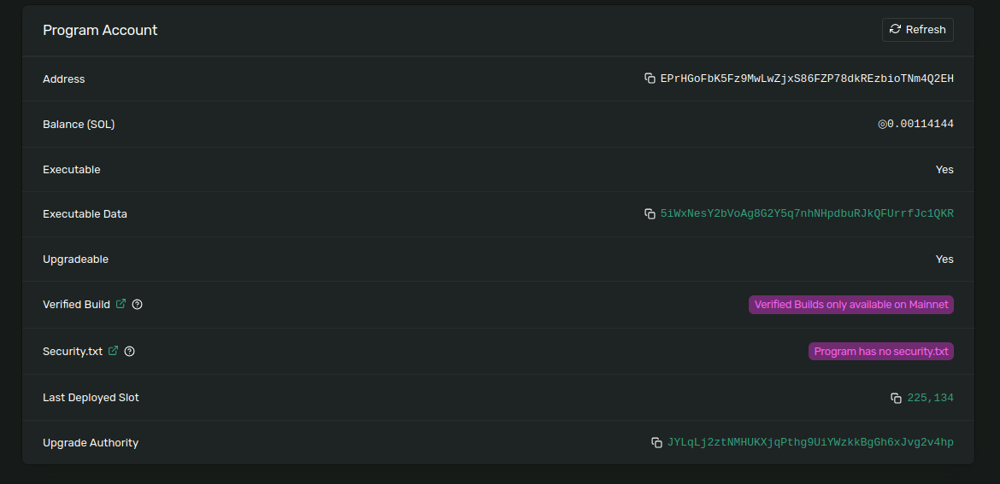

# 运行测试用例
```
unset CARGO_TARGET_DIR
anchor test --provider.wallet `solana config get keypair | awk -F ':' '{print $2}' ` --skip-local-validator
```

# 查看log
```shell
ls .anchor/program-logs/
```
# 编译的程序大小
```shell
ljl@ljl-lenovo:an5$ ls target/deploy/an5.so -al
-rwxrwxrwx 1 ljl ljl 189400 Dec  3 11:09 target/deploy/an5.so

```

# 根据合约地址，查看acount
```shell
Public Key: EPrHGoFbK5Fz9MwLwZjxS86FZP78dkREzbioTNm4Q2EH
Balance: 0.00114144 SOL
Owner: BPFLoaderUpgradeab1e11111111111111111111111
Executable: true
Rent Epoch: 18446744073709551615
Length: 36 (0x24) bytes
0000:   02 00 00 00  46 11 6e 47  87 0c fa fe  00 c2 7a e6   ....F.nG......z.
0010:   be bf 22 b2  4f 79 6e a5  e7 14 8e 39  52 cc eb 04   ..".Oyn....9R...
0020:   19 44 4a 38          
````
# 上面的地址的4个字节后，就是合约的 execeutable data
```shell
echo -n '5iWxNesY2bVoAg8G2Y5q7nhNHpdbuRJkQFUrrfJc1QKR' | base58 -d |xxd -p
46116e47870cfafe00c27ae6bebf22b24f796ea5e7148e3952cceb041944
4a38
```
[EPrHGoFbK5Fz9MwLwZjxS86FZP78dkREzbioTNm4Q2EH](https://explorer.solana.com/address/EPrHGoFbK5Fz9MwLwZjxS86FZP78dkREzbioTNm4Q2EH?cluster=custom&customUrl=http%3A%2F%2Flocalhost%3A8899)


# 部署合约的程序数据空间

```shell

ljl@ljl-lenovo:an5$ solana account 5iWxNesY2bVoAg8G2Y5q7nhNHpdbuRJkQFUrrfJc1QKR |grep Length
Length: 189445 (0x2e405) bytes
25510:   4c 65 6e 67  74 68 45 78  63 65 65 64  65 64 42 75   LengthExceededBu
25ad0:   6f 6e 54 72  61 63 65 4c  65 6e 67 74  68 45 78 63   onTraceLengthExc
272f0:   65 4d 75 73  74 48 61 76  65 4c 65 6e  67 74 68 43   eMustHaveLengthC

```


- ** TODO : 通过监听solana logs ，发生了多次交易，具体细节以后可以深入研究 **
